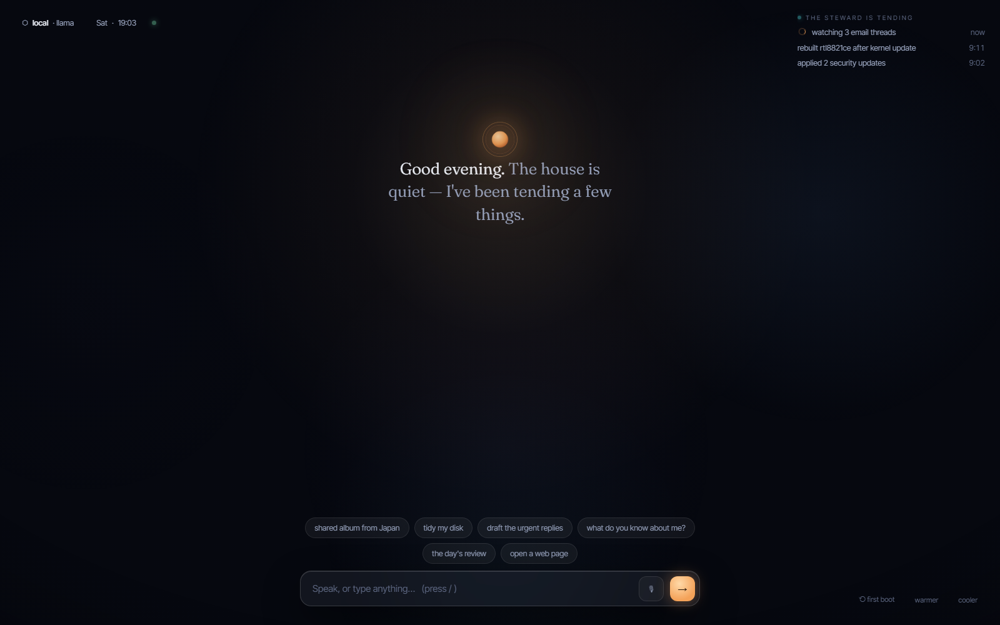

# Hearth OS

### The computer that works for you.

You don't operate it. You just say what you want.

---

Today, your computer waits. You learn its menus, push its buttons, and do all the work yourself.

**Hearth is a computer with a mind.** A calm, capable presence that understands what you're trying to
do — and does it. You don't open apps. You don't manage windows. You ask, and the right thing appears,
then quietly clears away when you're done.

It isn't a chatbot in a box. It's the whole machine, reimagined around you.

## What it feels like

#### Just ask.
Say *“make a shared album from my trip”* or *“tidy up my downloads.”* Hearth builds exactly what the
moment needs, does the work, and puts it away. Nothing to find, nothing to learn.

#### It learns you.
The more you use it, the better it knows you — your habits, your people, your way of doing things. And
everything it knows is kept in plain words you can read, change, or erase. Nothing about you is hidden.

#### Nothing happens behind your back.
Before it does anything that matters, it shows you — in plain language — exactly what it's about to do,
and asks. Anything can be undone with a single gesture. Powerful, and always answerable to you.

#### It's yours.
Use whatever AI you prefer — on your own machine, or a service you choose — and switch anytime; it
still knows you. Every line of it is open. The machine is yours, and it stays yours.

## See it

Open **[`mockup/the-hearth.html`](mockup/the-hearth.html)** in your browser — just double-click. It's a
living preview of the whole experience. Nothing to install.

## The story so far

Hearth is being built in the open, one piece at a time. The mind underneath — the part that listens,
plans, acts safely, and remembers — is already real and working. Where it goes next:
**[the roadmap](ROADMAP.md)**.

## Go deeper

The vision, the design, and the engineering are all written down in **[`docs/`](docs/)**. Start with
**[the vision](docs/VISION-AND-ARCHITECTURE.md)** — or **[build it with us](CONTRIBUTING.md)**.

## Open & free

Hearth is open source under **[GPL-3.0-or-later](LICENSE)** — copyleft by design, so it can never be
taken private or made closed. The freedom it gives you can't be taken away.

 

*The machine is a steward, not a tool.*

